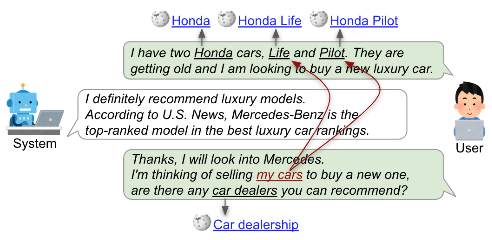

Conversational Entity Linking: Tool and Extended Dataset
========================================================

[](https://colab.research.google.com/drive/1TXoecXn9-JeS-hd4a0vtUQPN7xJGc2C0?usp=sharing)

This repository provides (1) conversational entity linking dataset (CEL) and (2) conversational entity linking tool (CREL), as resources for the following research:

```
TBD
```

<!--  -->


**Figure: The example of entity linking in conversations.**

This repository is structured in the following way:

- `dataset/` : Conversational entity linking datasets (CEL), with the documentation of the statistics and format.
- `eval/` : Tool to calculate the performance of the entity linking method, with the run files of baseline and our method.
- `tool/` : EL tool for conversation (CREL), with the example script.


# CEL: Conversational Entity Linking Dataset

## Dataset

Our CEL dataset contains concepts, named entities (NEs), and personal entity annotations for conversations. This annotations is collected on [Wizard of Wikipedia](https://arxiv.org/abs/1811.01241) dataset. The format and detailed statistics of the dataset are described here [./dataset/README.md](https://github.com/informagi/conversational-entity-linking-2022/tree/main/dataset).

**Table 1: Statistics of conversational entity linking dataset**

|                                        |   Train |   Val |   Test |
|:---------------------------------------|--------:|------:|-------:|
| Conversations                          |     174 |    58 |     58 |
| User utterance                         |     800 |   267 |    260 |
| NE and concept annotations             |    1428 |   523 |    452 |
| Personal entity annotations            |     268 |    89 |     73 |


The format of the dataset is as follows:
```py
{
    "dialogue_id": "9161",
    "turns": [
        {
            "speaker": "USER", # or "SYSTEM"
            "utterance": "Alpacas are definitely my favorite animal.  I have 10 on my Alpaca farm in Friday harbor island in Washington state.",
            "turn_number": 0,
            "el_annotations": [ # Ground truth annotations
                {
                    "mention": "Alpacas",
                    "entity": "Alpaca",
                    "span": [0, 7],
                }, ...]
            "personal_entity_annotations": [ # Personal entity annotations
                {
                    "personal_entity_mention": "my favorite animal",
                    "explicit_entity_mention": "Alpacas",
                    "entity": "Alpaca"
                }
            ],
            "personal_entity_annotations_without_eems": [ # Personal entity annotations where EEM annotated as not found
                {
                    "personal_entity_mention": "my Alpaca farm"
                }
            ]
        },
```
You can find more details about the format of the dataset in the [./dataset/README.md](https://github.com/informagi/conversational-entity-linking-2022/tree/main/dataset)

Additionally, we also provide [personal entity linking mention detection dataset](https://github.com/informagi/conversational-entity-linking-2022/tree/main/dataset#personal-entity-mention-detection-annotations), which contains 985 conversations with 1369 personal entity mention annotations.

## Evaluation

The tool to evaluate your entity linking method is provided in the `eval/` directory. The detail explanations are available here [./eval/README.md](https://github.com/informagi/conversational-entity-linking-2022/tree/main/eval).

# CREL: EL Tool for Conversations


## Quickstart with Google Colab

The easiest way to get started with this project is to use our [Google Colab](https://colab.research.google.com/drive/1TXoecXn9-JeS-hd4a0vtUQPN7xJGc2C0?usp=sharing) code. By just running the notebook, you can try our entity linking approach.

The usage of the tool is as follows:

```py
from conv_el import ConvEL
cel = ConvEL()

conversation_example = [
    {"speaker": "USER", 
    "utterance": "I am allergic to tomatoes but we have a lot of famous Italian restaurants here in London.",}, 

    # System turns are not annotated
    {"speaker": "SYSTEM", 
    "utterance": "Some people are allergic to histamine in tomatoes.",},

    {"speaker": "USER", 
    "utterance": "Talking of food, can you recommend me a restaurant in my city for our anniversary?",},
]

annotation_result = cel.annotate(conversation_example)
print_results(annotation_result) # This function is defined in the notebook.

# Output:
# 
# USER: I am allergic to tomatoes but we have a lot of famous Italian restaurants here in London.
# 	 [17, 8, 'tomatoes', 'Tomato']
# 	 [54, 19, 'Italian restaurants', 'Italian_cuisine']
# 	 [82, 6, 'London', 'London']
# SYST: Some people are allergic to histamine in tomatoes.
# USER: Talking of food, can you recommend me a restaurant in my city for our anniversary?
# 	 [11, 4, 'food', 'Food']
# 	 [40, 10, 'restaurant', 'Restaurant']
# 	 [54, 7, 'my city', 'London']
```

where, input for our tool is a conversation which has two keys for each turn: `speaker` and `utterance`. The `speaker` is the speaker of the utterance (either `USER` or `SYSTEM`), and the `utterance` is the utterance itself.

<details>
<summary>Note</summary>

- Use CPU to run this notebook.
    - The code also run on GPU, however, because of the storage limitation, you cannot try GPU on Google Colab if you use free version.
- It takes approx 30 mins to download the models. Please wait for a while.

</details>

## Start on your local machine

You can also use our method locally. The documentation is available at [./tool/README.md](https://github.com/informagi/conversational-entity-linking-2022/tree/main/tool).

