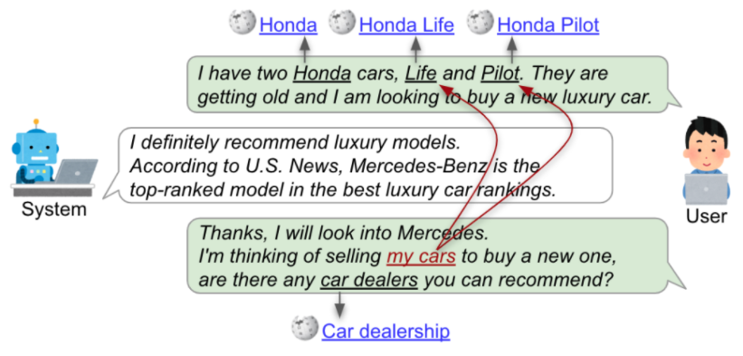

Conversational Entity Linking: Tool and Extended Dataset
========================================================

[](https://colab.research.google.com/drive/1TXoecXn9-JeS-hd4a0vtUQPN7xJGc2C0?usp=sharing)

This repository provides (1) conversational entity linking dataset (CEL) and (2) conversational entity linking tool (CREL), as resources for the following research:

```
TBD
```



**Figure 1: The example of entity linking in conversations. The green and gray speech bubbles represent user and system turns, respectively. In conversations, not only name entities, but concepts (e.g., “tomatoes”) and personal entities (e.g., “my neighborhood”) are important.**

This repository is structured in the following way:

- `dataset/` : Conversational entity linking datasets (CEL), with the documentation of the statistics and format.
- `eval/` : Tool to calculate the performance of the entity linking method, with the run files of baseline and our method.
- `tool/` : EL tool for conversation (CREL), with the example script.


# CEL: Conversational Entity Linking Dataset

## Dataset

Our CEL dataset contains concepts, named entities (NEs), and personal entity annotations for conversations. This annotations is collected on [Wizard of Wikipedia (WoW)](https://arxiv.org/abs/1811.01241) dataset. The format and detailed statistics of the dataset are described here XX.

**Table 1: Statistics of conversational entity linking dataset**

|                                        |   Train |   Val |   Test |
|:---------------------------------------|--------:|------:|-------:|
| Conversations                          |     174 |    58 |     58 |
| User utterance                         |     800 |   267 |    260 |
| NE and concept annotations             |    1428 |   523 |    452 |
| Personal entity annotations            |     268 |    89 |     73 |

Additionally, we also provide personal entity linking mention detection dataset, which contains 985 conversations with 1369 personal entity mention annotations.

## Evaluation

The tool to evaluate your entity linking method is provided in the `eval/` directory. The detail explanations are available here XX.

# CREL: EL Tool for Conversations

## Quickstart with Google Colab

The easiest way to get started with this project is to use our [Google Colab](https://colab.research.google.com/drive/1TXoecXn9-JeS-hd4a0vtUQPN7xJGc2C0?usp=sharing) code. By just running the notebook, you can try our entity linking approach.

**Note**

- Use CPU to run this notebook.
    - The code also run on GPU, however, because of the storage limitation, you cannot try GPU on Google Colab if you use free version.
- It takes approx 30 mins to download the models. Please wait for a while.

## Start on your local machine

You can also use our method locally. The documentation is available at `./tool/conversational_entity_linking.ipynb`


